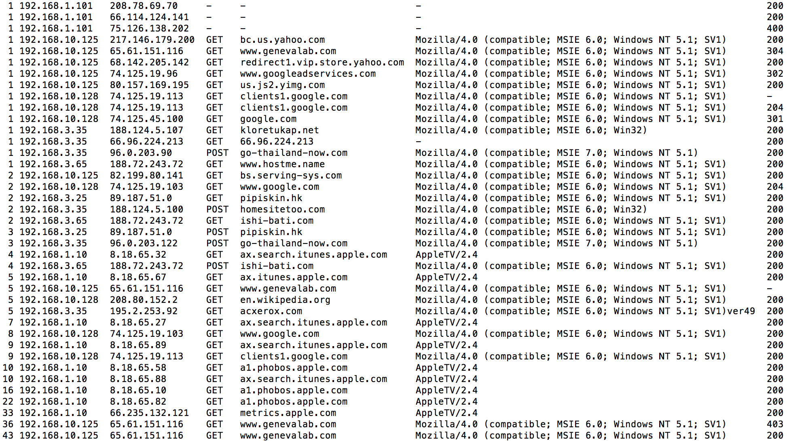

**EXAMPLE:**
elsa_query.py -q "1.1.1.1" -w -l 1000
- query ELSA for all BRO_HTTP logs with 1.1.1.1 as the src or dst, return 1000 logs.  Then analyze the BRO_HTTP logs and build a html report.

**Required for SecurityOnion analysis VM:**
- sudo apt-get install python-pip
- sudo pip install yattag
- sudo pip install configparser

**Usage:**
        elsa_query.py --query "127.0.0.1 dstport:80 groupby:dstip" --print -l 1000

        -a, --apikey  : Elsa API key
                        If not specified then read it from the elsa_query.ini file
                        If this option is used then specify options -i and -u or accept the their defaults.
        -e, --end     : End date in the form of '2016-04-30 16:47:53'
                        Default is now
        -i, --ip      : Elsa server IP
                        Default is '127.0.0.1'
        -l, --limit   : The number of records to return
                        Do not use the limit directive in the search string
                        Default is 100
        -p, --print   : Print search results to stdout
        -q, --query   : Elsa query string
        -s, --start   : Start date in the form of '2016-04-30 16:47:53'
                        Default is yesterday at midnight
        -u, --user    : Elsa user
                        Default is 'elsa'
        -v, --verbose : Print verbose results
        -w, --http    : Analyze BRO_HTTP logs
                        No need to include class:BRO_HTTP as it will be added by this script

        When running this on Windows you will need to escape quotes in the Elsa search string with a quote.
            \_> For example: "127.0.0.1 BRO_HTTP.uri=""/test/testing/"""
        Note that an Elsa API search will search the entire available time range by default.
            \_> Therefore use the start and end options to specify the query window.
            \_> If no start is specified, a start date of yesterday at midnight is assumed.
            \_> If no end date is set, then an end date of now is assumed.

**Print the search results to standard out and data stack:**

elsa_query.py -z -p -q "class=BRO_HTTP" -l 1000 | cut -d'|' -f3,5,8,9,12,15 | sort | uniq -c | sort -r -t'|' -k1 | column -s'|' -t

